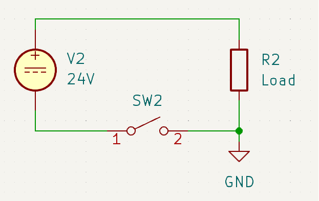

# Low Side Switching
Note: some of this (especially terminology) has been slightly simplified and not all edge cases were accounted for, for the sake of clarity. I tried to retain accuracy and nuance everywhere it is important to understand the concepts. I figure if you're able to identify the changes, you probably don't need to be reading this anyway

## So what is it?

When you are switching an electronic load in a simple DC circuit, you have two options. You can switch the positive voltage going to the load (hereinafter, the supply), or you can switch the negative (or zero) voltage coming back from the load (hereinafter, the return). We call the former "high-side switching" and the latter "low-side switching".

If you prefer a visual illustration:

This is a high side switched circuit:

This is a low side switched circuit:

## But why? This seems stupid

On the surface, low-side switching seems like a terrible idea. After all, it leaves the load energized even when the switch is off! And in many cases we do switch the high side, for example, the light switches in most buildings. But low-side switching also has its advantages:

### Use with MOSFETs

Lots of times one might wish to switch a load automatically, rather than throwing a physical switch. There are various ways of accomplishing this, but one of the most common (on DC circuits) is a MOSFET. They can be used for many things, and the details of how they work are beyond the scope of this document.For the purposes of this document you can think of them as voltage controlled switches. They have three terminals, a drain, a gate, and a source. The drain is the "positive" terminal (higher voltage), source is the "negative" terminal (lower voltage), and the gate controls whether the switch is closed or open.

There are two1 main types, N-chammel (NMOS) and P-channel (PMOS) (these are somewhat analogous to NPN and PNP BJTs). Generally (or at least conceptually) NMOS is used for low-side switching, and PMOS is used-for high side switching2. On an NMOS, the gate is referenced to the device's source, and on PMOS it's referenced to the drain. Importantly, *in neither case is the gate referenced to the global 0V net (often called GND)*. To turn on an NMOS, you have to drive the gate above the drain, which in this case means above the load's return. This is pretty easy. To turn on a PMOS, you have to drive the gate below the supply, which is less so. So we often like to use NMOS in a low-side configuration when possible.

### Variable supply voltages

One really cool thing that you can do with low-side switching is use the same switch for different supply voltages. You see this often on things like the fan headers on 3d printer mainboards, where you can select different voltages depending on the fan, but use the same physical connector. From the microcontroller's perspective, it's just flipping a switch. It doesn't know or care3 what's attached. Because the switch is on the return, you can connect any supply voltage you want (within the rating of the MOSFET45). This also means you can switch voltages higher than the microcontroller's (or gate driver's) IO voltage. If you tried to do that with a high-side switch and a PMOS, you'd have to do some electrical gymnastics to avoid breaking the microcontroller.

## Ok, this has been fun and all, but why should I care?

There are two main problems you can run into with 3d printers if you don't understand low side switching:

### Probing voltages

When you check if a port is turning on with a multimeter, you must make sure to measure with the negative probe on the port's return (negative pin). For maximum simplicity, just measure across the two terminals on the port if at all possible. You can however get the positive voltage from anywhere it exists if it is more convenient to do so, but *you must use the port's specific return*

### Connecting devices with shared wires

Intuitively, if you want to save some wiring (for example wires going to the toolhead), it would make sense to combine the returns for all the devices and send individual +24V (or whatever voltage it runs off). Due to low-side switching being used, you must in fact do the opposite. You can combine the +24V/V+ but you must have separate returns for each device.

## Footnotes

1 yes, yes, there are actually more like 4. For these writeup we'll assume the more common enhancement mode MOSFETs are being used

2 to do it the other way you'd need to drive the gate outside the bounds of the supply voltage, which tends to be rather annoying

3 seriously? now you're complaining I didn't put a parenthetical in about breaking stuff?

4 this will be vds in the absolute maximum ratings section of the datasheet. Vds stands for Voltage Drain to Source or something like that

5 fiiiine I'll point out that that source must share a return with the MOSFET's source terminal, or things will not go well. Are you happy now?
