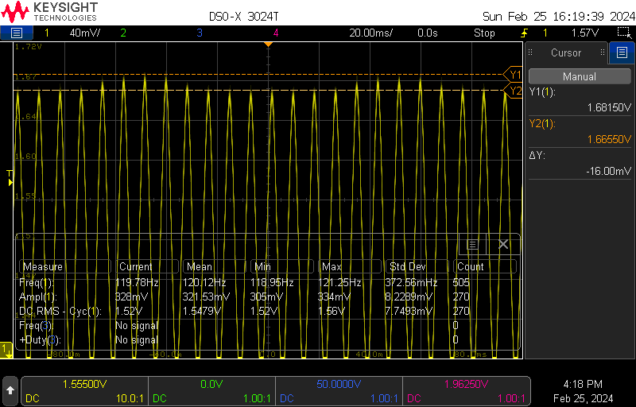
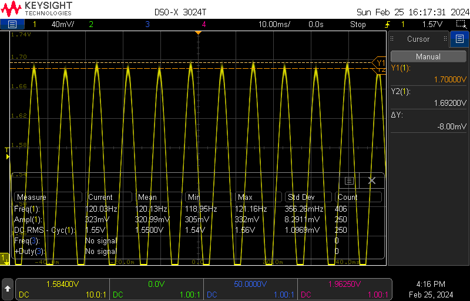
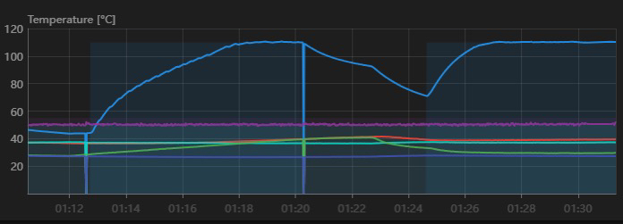
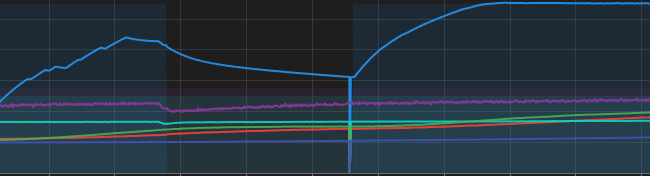

# Reducing flicker from your bed

## tl;dr
Sorry, you have to read the whole thing this time, to understand what you are getting into

## Why flicker happens

* A large load like a 3d printer bed causes a significant disruption to the power supply when it is switched. Usually you will see a voltage drop in a dumb system like mains electrical1.
* If there are lights on the circuit, the voltage drop pulses can cause the light to lower in brightness when the bed is on, and raise in brightness when the bed is off1.

Here's some actual data:

(sine wave with voltage drop)[images/Phototransistor_capture_LED_Flickering.png]

(image credit Royicus)

Here you can see how the mains voltage near the printer drops when the bed is one.

A lamp was connected and a phototransistor was used to gauge the light output, and as you can see in these captures the output majorly fluctuates at the default 10Hz frequency:

(image credit Royicus)

## Options for reducing flicker
### Change the bed-heater frequency to 44.9 or 48.9 Hz
**Note**: All frequencies discussed in this section are relative to a 60Hz mains system. If your mains frequency is 50Hz you will probably experience similar results adjusting the numbers proportionally, however, this has not been tested.

It seems that 44.9 or 48.9 Hz results in a sweet spot between reducing flicker and causing instability during heating (see below). To set this, simply add a line in the `[bed_heater]` section of your Klipper config: `cycle_time = 0.2227` (44.9 Hz) or `cycle_time = 0.020449` (48.9Hz). If you already have a `cycle_time` line simply change the number.

With this frequency applied you can see that the lamp brightness fluctuates far less:

(image credit Royicus)

Which of those two numbers works better seems to be variable, you can see more detailed data, credit Royicus, (here)[data]

#### Why you should not set the PWM frequency to or near your mains frequency
There is a decent chance you will get heating instability, such as:

(images taken at 60Hz, credit Thor)

The reason for this is the SSR only switches at zero-crossings, and if the switching frequency is close enough to the mains frequency the SSR can wind up getting sort of locked, where it can't control whether the power is fully on or half on, so the heating becomes erratic. You can see the problematic power waveform below;

(image credit Ark)

### Change to different light bulbs
* Lower power lightbulbs have been observed to flicker less, with the exception of 40W equivalent GE bulbs
* GE relax bulbs seem to perform the best of the ones tested, including GE classic, Lowe's store brand, and IKEA.

### Install an inlet filter

## Footnotes:
1 LED and CFL lightbulbs won't behave *quite* that simply, but the end result is still flicker, based on the variation in RMS line voltage

## Attributions:
This was a major team effort on the Voron discord, but special recognition should go to:
* Voron discord user Royicus, for many scope captures and much testing
* Voron discord user Arc, for coming up with the numbers and some scope captures showing the reasons for instability at mains frequency
* Voron discord user Thor, for images

# old stuff, remove later:

## Common methods of reducing flicker

* Inlet filter
    - An inlet filter will filter out minor changes in voltage and prevent them from feeding back onto the mains circuit. However, most are designed to filter out much higher frequencies that the frequency that causes the flicker
* Setting the PWM frequency of the bed controller to the mains frequency
    - This is not recommended.
    - See common misconceptions below

## Common misconceptions

* Setting the SSR to the mains frequency will reduce flicker
    - to my knowledge, there is no magical property about setting the pwm frequency to the mains frequency that reduces flicker. Rather, by design, mains frequency is around the point where human eyes are unable to see flicker any more, so for people who are not particularly sensitive to flicker, this may appear to be a solution.
    - This has significant drawbacks. Mainly the PID controller for the bed can become unstable2
* If you set the bed pwn frequency to the mains frequency the relay can become locked on or off
    - This may be true if you set the frequency to *twice* the mains frequency and get really unlucky. The pwm period and the mains period must be very close for this to happen, and they must have a particular phase difference.
    - Usually any ssr related issues are caused by something else. See above about PID instability as well as footnote 2.

## Okay, I've read everything but I still want to try it. How do I maximize my chance of success?

* First, set your period to be different from your mains frequency, ***but not higher***. For whatever reason, this seems to help a bit.
    - If you set the period to above your mains frequency, especially if you set it to above twice your mains frequency, the ssr will not really follow the PID instructions and bizarre behavior will occur (todo: test and verify)
* After you change the frequency, do a PID tune and make sure to save it.
    - If the tune fails, try tuning to a lower temperature, saving, and then tuning at the high temperature. In rare cases three steps may be necessary.
* Watch the heat graph closely for signs of instability the first few times you heat the bed afterwards.

## footnotes
1 In smart systems with a voltage regulator you will usually see an undershoot when the load is switched on and an overshoot when the load is switched off

2 The SSRs we use only switch at zero crossings which means, for 50Hz, you get an opportunity to switch every 10ms. I've drawn a diagram that attempts to show all of this. The zero crossings are highlighted with red lines to sort of line up with the rest of the diagram. The graph above the sine wave is a representation of different PWM duty cycles when the cycle time is the mains period, and the graph below shows different pwm duty cycles when the period is 5 times the mains period.

***todo add graph***

If the cycle_time is left at the default 100ms, it means the relay can switch at 10 different points of the pwm cycle, giving the PID controller up to 11 options for power intensity during that cycle. This seems to be sufficient resolution, though I have heard of people increasing the cycle time to increase steady-state stability.
Image
As the cycle time shortens, the number of power intensity options available to the PID controller decreases, and past a certain point there isn't sufficient resolution for the loop to remain stable (the change in resolution is also why you should re-tune the PID controller after adjusting the cycle time for any reason). It seems that running at the mains frequency is too fast. It gives two switching points per period which only allows intensities of 0, 50, and 100%. I suspect it will get harder and harder to retain stable control the shorter the period and there will be a limit somewhere, but I haven't tested that

Note that this doesn't actually have anything to do with being exactly the mains frequency, it doesn't matter if the pwm frequency is a harmonic of the mains frequency or not, just that it is similar in magnitude, for the problem to occur. Likewise I'm not convinced that the phenomenon where setting the cycle_time to or near the mains period seems to remove flickering is actually related to harmonics or even electrical at all, it could just be that 50/60Hz is, for some people, above the frequency where they can observe flickering.

