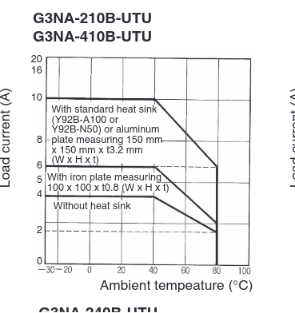

# How to calculate the maximum power your SSR can support

## tl;dr
* todo add summary here

## Introduction
SSRs are often specified by the maximum current they can pass without taking damage. However, this specification is generally based on the assumption that you are using the heatsink, and a hefty derate applies when you are not.

## How to determine the maximum RMS power your SSR can support

### Derate curves
Every SSR should have a datasheet, which will include a derate curve that looks like this:


(this is from the Omron G3NA-210B-UTU-DC5-24 datasheet, found [here](hhttps://assets.omron.com/m/453bbd7a38a218b5/original/G3NA-Series-Solid-State-Relay-Datasheet.pdf))

For this particular relay, while it is nominally a 10A relay, it actually only supports 4A without the heatsink.

### mathy stuffs

First we will calculate the maximum power the SSR can support<sup>1</sup>. This is based on its rated current and your mains voltage (generally 120V or 230V nominal, depending on location). Power=current\*voltage. As an example for a 750W heater, assuming 120V nominal:

```math
P=IV
P=4A\cdot 120V
P=480W
```
This is about 64% of the heater mat's power. However, while we could just set the maximum duty cycle in the Klipper config to 0.64, we can actually get a bit more power though the magic of RMS.

RMS stands for Root Mean Square and is essentially a fancy pile of math that gets you the equivilent DC voltage or current of a periodic waveform, like the PWM signal sent by the mainboard to switch the heater. You can think of this as sort of the conceptual average of the wave<sup>2</sup>, though it is not the mathematical average.

Long story short, the RMS voltage calculation for a square wave with a given duty cycle is $A_{peak}\cdot\sqrt(duty_cycle)$ , where the duty cycle is expressed as a decimal between 0 and 1, and $A_{peak}$ is the maximum amplitude of the square wave (in other words, the "high" value, when we set the low value to 0). Because we we are looking at current, we can redefine $A_{peak}$ as $I_{peak}$ , and because $P=IV$ we can conclude $I_{peak}=P/V$ . Based on this, we can do some mathy stuff to determine the maximum duty cycle we can set without overloading the relay:

```math
I_{rms}=I_{peak}\cdot\sqrt(duty_cycle)
\frac{I_{rms}}{I_{peak}}=\sqrt(duty_cycle)
duty_cycle=(\frac{I_{rms}}{I_{peak}})^2
```

Now with example numbers, for a 4A rated relay, 750W bed, and 120V mains

```math
I_{rms}=4
I_{peak}=\frac{750W}{120V}=6.25A
4A=6.25A\cdot\sqrt(duty_cycle)

```

## Footnotes
<sup>1</sup> It is important to remember that the SSR is not dissipating this power. This calculation is the maximum power of the load that the SSR switches.

<sup>2</sup> The actual average is different from the RMS, and generally less useful.
